# LASER Beam Scattering in FOG: Mie & Monte Carlo Simulation

[](https://www.python.org/downloads/)
[](https://opensource.org/licenses/MIT)
[](https://github.com/PuspenduPH/fog-scattering-mc-simulation)
[](fog_scattering_final.ipynb)

A modular, object-oriented numerical framework that models and visualizes laser beam propagation through atmospheric fog. This repository reproduces and extends the computational methodology presented by **Xu et al. (2023)** (*The Multiple Scattering of Laser Beam Propagation in Advection Fog and Radiation Fog*, International Journal of Optics) by combining **Lorenz-Mie single-scattering integration** with a **3D Photon Weight Tracking Monte Carlo (MC) radiative transfer algorithm**.

---

## 📌 Table of Contents
- [LASER Beam Scattering in FOG: Mie \& Monte Carlo Simulation](#laser-beam-scattering-in-fog-mie--monte-carlo-simulation)
  - [📌 Table of Contents](#-table-of-contents)
  - [🎯 Overview \& Objectives](#-overview--objectives)
  - [📁 Repository Structure](#-repository-structure)
  - [🚀 Quickstart \& Installation](#-quickstart--installation)
    - [1. Clone the Repository](#1-clone-the-repository)
    - [2. Install Dependencies](#2-install-dependencies)
    - [3. Launch the Jupyter Notebook](#3-launch-the-jupyter-notebook)
  - [🔬 Physical \& Mathematical Methodology](#-physical--mathematical-methodology)
    - [1. Fog Microphysics \& Size Distributions](#1-fog-microphysics--size-distributions)
    - [2. Bulk Mie Optical Properties](#2-bulk-mie-optical-properties)
    - [3. 3D Monte Carlo Photon Transport](#3-3d-monte-carlo-photon-transport)
  - [📊 Key Results \& Visualizations](#-key-results--visualizations)
    - [Microphysical \& Bulk Optical Properties (Figures 1–4)](#microphysical--bulk-optical-properties-figures-14)
      - [Figure 1: Droplet Size Distributions $n(r)$](#figure-1-droplet-size-distributions-nr)
      - [Figure 2: Extinction Coefficient $\\langle \\mu\_e \\rangle$ vs. Visibility](#figure-2-extinction-coefficient-langle-mu_e-rangle-vs-visibility)
      - [Figure 3: Single Scattering Albedo $\\langle \\omega\_0 \\rangle$ vs. Visibility](#figure-3-single-scattering-albedo-langle-omega_0-rangle-vs-visibility)
      - [Figure 4: Asymmetry Factor $\\langle g \\rangle$ vs. Visibility](#figure-4-asymmetry-factor-langle-g-rangle-vs-visibility)
    - [Photon Trajectory \& Spatial Diffusion Profiles (2D \& 3D)](#photon-trajectory--spatial-diffusion-profiles-2d--3d)
      - [2D ($X-Z$) Photon Trajectory Classification](#2d-x-z-photon-trajectory-classification)
      - [3D ($X-Y-Z$) Teardrop Diffusion Profile](#3d-x-y-z-teardrop-diffusion-profile)
      - [2D Propagation Depth Comparison ($Z\_{\\max}$)](#2d-propagation-depth-comparison-z_max)
      - [3D Propagation Depth Comparison (2x2 Grid)](#3d-propagation-depth-comparison-2x2-grid)
    - [Animated 3D Photon Transport](#animated-3d-photon-transport)
      - [Rotating 3D Teardrop Diffusion ($N=200, \\mu\_e=20,\\text{km}^{-1}$)](#rotating-3d-teardrop-diffusion-n200-mu_e20textkm-1)
      - [Rotating 2x2 Propagation Depth Matrix](#rotating-2x2-propagation-depth-matrix)
      - [Step-by-step Photon Propagation ($\\mu\_e = 10.0,\\text{km}^{-1}$, 500 Photons, $Z = 250,\\text{m}$)](#step-by-step-photon-propagation-mu_e--100textkm-1-500-photons-z--250textm)
    - [Angular Scattering Intensity Sweeps (Figures 5–7 Reproductions)](#angular-scattering-intensity-sweeps-figures-57-reproductions)
      - [Figure 5: Albedo Sweep ($\\omega\_0 \\in {0.1, 0.3, 0.6}$ at fixed $g=0.75$)](#figure-5-albedo-sweep-omega_0-in-01-03-06-at-fixed-g075)
      - [Figure 6: Asymmetry Sweep ($g \\in {0.25, 0.50, 0.75}$ at $\\omega\_0=0.9$)](#figure-6-asymmetry-sweep-g-in-025-050-075-at-omega_009)
      - [Figure 7: Backscattering Intensity Across Wavelengths \& Fog Types ($V=0.6,\\text{km}$)](#figure-7-backscattering-intensity-across-wavelengths--fog-types-v06textkm)
  - [🧠 Discussion \& Physical Insights](#-discussion--physical-insights)
    - [1. Near-IR vs. Far-IR Wavelength Trade-offs](#1-near-ir-vs-far-ir-wavelength-trade-offs)
    - [2. Engineering \& System Architecture Implications (FSO vs. LiDAR)](#2-engineering--system-architecture-implications-fso-vs-lidar)
    - [3. Numerical Methodology \& Error Analysis](#3-numerical-methodology--error-analysis)
  - [📚 References](#-references)

---

## 🎯 Overview & Objectives

Atmospheric fog introduces severe optical degradation for **Free-Space Optical (FSO) communication links**, **autonomous vehicle LiDAR**, and **laser remote sensing**. Fog consists of polydisperse water droplets whose sizes span from sub-micron fractions to tens of micrometers. When probed by laser beams ($0.86\,\mu\text{m}$ to $10.6\,\mu\text{m}$), photons undergo a complex chain of scattering, refraction, diffraction, and thermal absorption.

This repository provides two robust, interoperable core classes:
1. `FogOpticalModel`: Integrates exact single-droplet Mie scattering efficiencies ($Q_e, Q_s, g$) over modified Gamma droplet size distributions $n(r)$ to compute macroscopic bulk extinction $\langle \mu_e \rangle$, single-scattering albedo $\langle \omega_0 \rangle$, and asymmetry factor $\langle g \rangle$ across any visibility ($0.01\text{ to }10\,\text{km}$) and laser wavelength.
2. `PhotonTransportMC`: Simulates 3D Markov chain photon trajectories using Henyey-Greenstein (HG) phase functions, continuous implicit weighting with Russian Roulette survival, coordinate singularity protection, and exact solid-angle normalization to compute angular scattering intensities $I(\theta)$ and spatial diffusion envelopes.

---

## 📁 Repository Structure

```text
fog-scattering-mc-simulation/
├── fog_scattering_final.ipynb       # Main comprehensive notebook with all classes, derivations, & plots
├── content.md                       # Presentation slide outlines and physical narrative summaries
├── requirements.txt                 # Python dependency list
├── OUTPUTS/                         # All simulation output data, plots, and animations
│   ├── PLOTS/                       # High-resolution PNG figures (Figures 1-7, 2D/3D trajectories)
│   ├── ANIMATIONS/                  # Rotating 3D GIFs and step-by-step propagation animations
│   └── DATA/                        # Compressed NPZ cache datasets and JSON parameter metadata
└── README.md                        # Project documentation (this file)
```

---

## 🚀 Quickstart & Installation

### 1. Clone the Repository
```bash
git clone https://github.com/PuspenduPH/fog-scattering-mc-simulation.git
cd fog-scattering-mc-simulation
```

### 2. Install Dependencies
Make sure you have Python 3.9+ installed, then run:
```bash
pip install -r requirements.txt
```

### 3. Launch the Jupyter Notebook
```bash
jupyter notebook fog_scattering_final.ipynb
```
All simulation sweeps leverage automated caching (`run_or_load_intensity_sweep`). When run, cached `.npz` datasets and `.json` metadata from `OUTPUTS/DATA/` are instantly loaded, allowing immediate plotting and visualization without lengthy re-computation.

---

## 🔬 Physical & Mathematical Methodology

### 1. Fog Microphysics & Size Distributions
Particle size distributions fundamentally dictate whether optical scattering falls into the geometric, Mie, or Rayleigh regimes. Both **Advection fog** (formed by warm moist air over cool surfaces) and **Radiation fog** (formed by overnight radiative cooling) are modeled via modified Gamma distributions:

$$n(r) = a r^2 \exp(-b r)$$

* **Advection Fog:**
  $$n_{\text{adv}}(r) = 3.73 \times 10^5 W^{-0.804} r^2 \exp\left(-0.2392 W^{-0.301} r\right)$$
* **Radiation Fog:**
  $$n_{\text{rad}}(r) = 5.400 \times 10^7 W^{-1.104} r^2 \exp\left(-0.5477 W^{-0.351} r\right)$$

*(where $r$ is the droplet radius in $\mu\text{m}$ and $W$ is the liquid water content in $\text{g/m}^3$ derived from visibility $V$).*

---

### 2. Bulk Mie Optical Properties
Integrating individual single-droplet cross sections across the polydisperse distribution yields the bulk propagation parameters:

$$
\begin{aligned}
\langle \mu_e \rangle &= \frac{\pi \int_0^\infty r^2 Q_e(r, \lambda, m) n(r)\,dr}{\int_0^\infty n(r)\,dr} \\[0.5cm]
\langle \mu_s \rangle &= \frac{\pi \int_0^\infty r^2 Q_s(r, \lambda, m) n(r)\,dr}{\int_0^\infty n(r)\,dr} \\[0.5cm]
\langle \omega_0 \rangle &= \frac{\langle \mu_s \rangle}{\langle \mu_e \rangle} \\[0.5cm]
\langle g \rangle &= \frac{\int_0^\infty r^2 Q_s(r, \lambda, m) g(r, \lambda, m) n(r)\,dr}{\int_0^\infty r^2 Q_s(r, \lambda, m) n(r)\,dr}
\end{aligned}
$$

* **Unit Conventions & Scaling:** Integrating with $r$ in $\mu\text{m}$ and $n(r)$ in $\text{m}^{-3}\mu\text{m}^{-1}$ introduces an exact $10^{-12}$ scaling multiplier to produce extinction coefficients $\mu_e$ in $\text{m}^{-1}$ (or $\text{km}^{-1}$ when multiplied by $1000$).

---

### 3. 3D Monte Carlo Photon Transport
The `PhotonTransportMC` class simulates 3D photon-packet transport under the following physical rules:
* **Free Path Sampling:** Step length $L$ between collisions is sampled via $L = -\frac{\ln \xi}{\mu_e}$ where $\xi \in (0, 1]$.
* **Implicit Weight Tracking & Russian Roulette:** Photons carry weight $w$ (initially $1.0$). At each step, absorbed energy $\Delta w = w(1-\omega_0)$ is deposited internally, and weight updates to $w \leftarrow w\omega_0$. If $w < 10^{-4}$, Russian Roulette decides survival ($10\%$ chance to survive with weight $10w$).
* **Henyey-Greenstein (HG) Phase Function:** Angular deflection $\theta$ is sampled from exact HG cumulative inversion:
  $$\cos \theta = \frac{1}{2g} \left[ 1 + g^2 - \left( \frac{1 - g^2}{1 - g + 2g\xi} \right)^2 \right], \quad g \ne 0$$
* **Solid-Angle Normalization:** Escape angles $\theta_i$ partitioned into bins of width $\Delta \theta$ are normalized by the exact differential conical solid angle $\Delta \Omega_i \approx 2\pi \sin \theta_i \Delta \theta$ to obtain radiometric intensity per steradian ($\text{sr}^{-1}$):
  $$I(\theta_i) = \frac{\sum_{j \in \text{bin } i} w_j}{N_{\text{total}} \cdot 2\pi \sin \theta_i \Delta \theta}$$

---

## 📊 Key Results & Visualizations

### Microphysical & Bulk Optical Properties (Figures 1–4)

#### Figure 1: Droplet Size Distributions $n(r)$
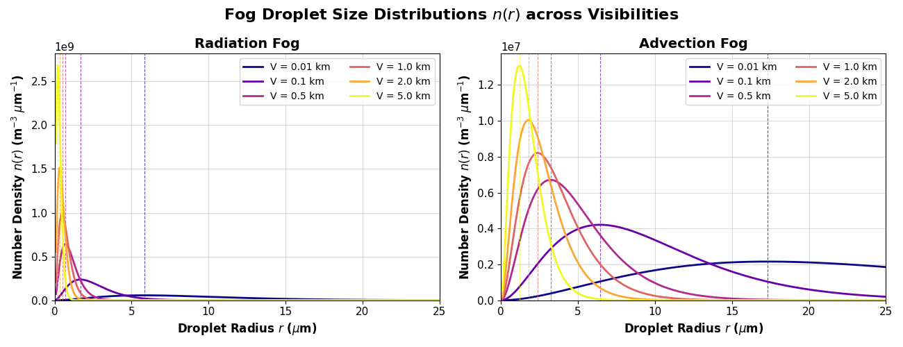

#### Figure 2: Extinction Coefficient $\langle \mu_e \rangle$ vs. Visibility
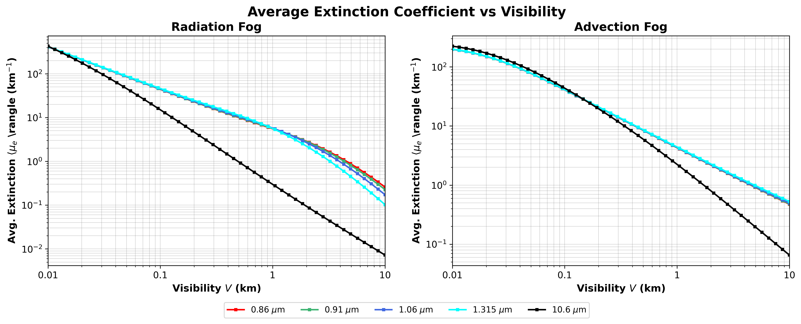

#### Figure 3: Single Scattering Albedo $\langle \omega_0 \rangle$ vs. Visibility
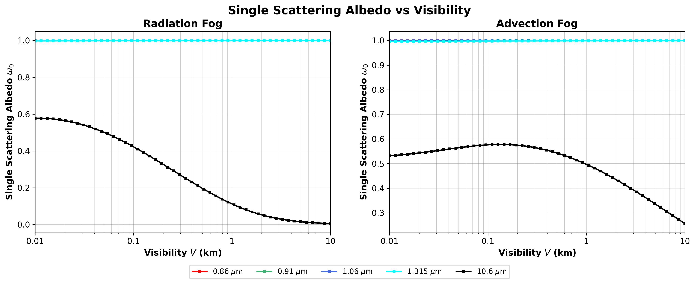

#### Figure 4: Asymmetry Factor $\langle g \rangle$ vs. Visibility
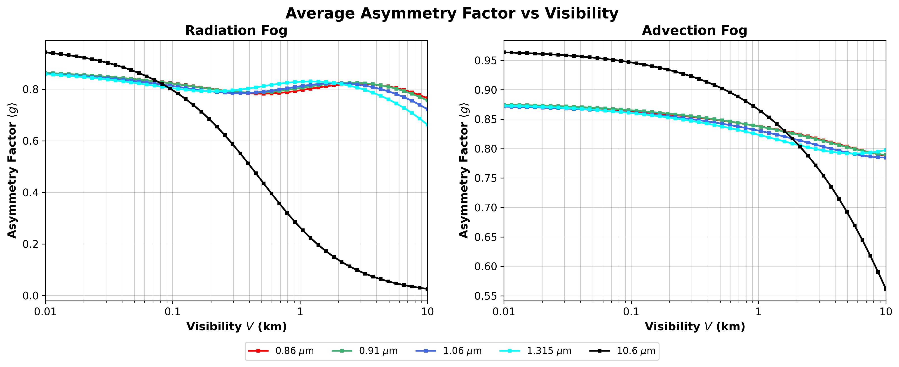

**Observations:**
* **Fig. 1:** Advection fog contains larger droplets ($r > 10\,\mu\text{m}$), whereas Radiation fog is densely populated by microscopic sub-micron droplets ($r < 4\,\mu\text{m}$).
* **Fig. 2:** Near-IR wavelengths ($0.86\text{–}1.315\,\mu\text{m}$) overlap almost perfectly because $2\pi r \gg \lambda$, reaching the geometric scattering limit ($Q_e \approx 2$). At $10.6\,\mu\text{m}$, smaller radiation fog droplets approach $\alpha \approx 1$, causing a **Mie resonance shift** where far-IR extinction drops significantly in lighter fogs ($V > 1\,\text{km}$).
* **Fig. 3:** Near-IR albedo stays near unity ($\omega_0 > 0.999$), indicating conservative elastic scattering. At $10.6\,\mu\text{m}$, water has a strong absorption band ($\kappa \approx 0.071$), causing albedo to plunge to $\omega_0 \approx 0.3\text{–}0.6$.
* **Fig. 4:** Near-IR exhibits strong forward focusing ($g > 0.75$). At $10.6\,\mu\text{m}$, as visibility increases and droplets shrink relative to wavelength, scattering transitions toward isotropic / Rayleigh scattering ($g \to 0$).

---

### Photon Trajectory & Spatial Diffusion Profiles (2D & 3D)

#### 2D ($X-Z$) Photon Trajectory Classification
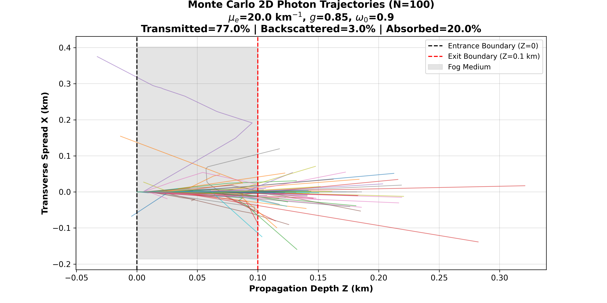

#### 3D ($X-Y-Z$) Teardrop Diffusion Profile
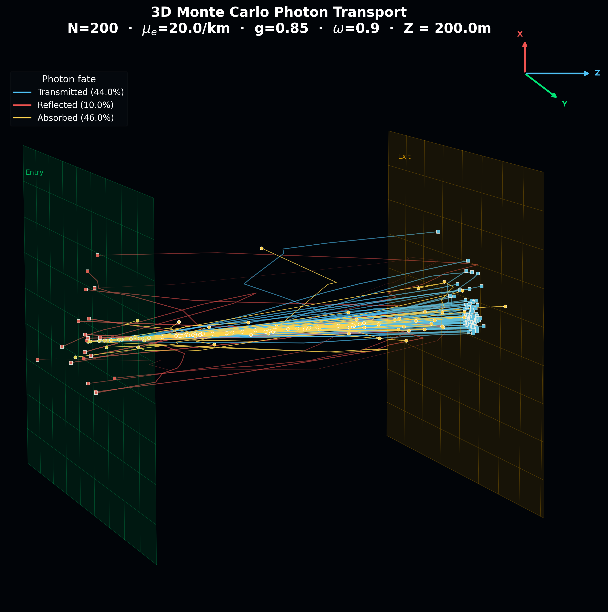

#### 2D Propagation Depth Comparison ($Z_{\max}$)
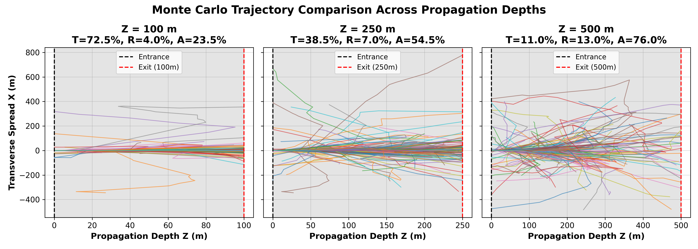

#### 3D Propagation Depth Comparison (2x2 Grid)
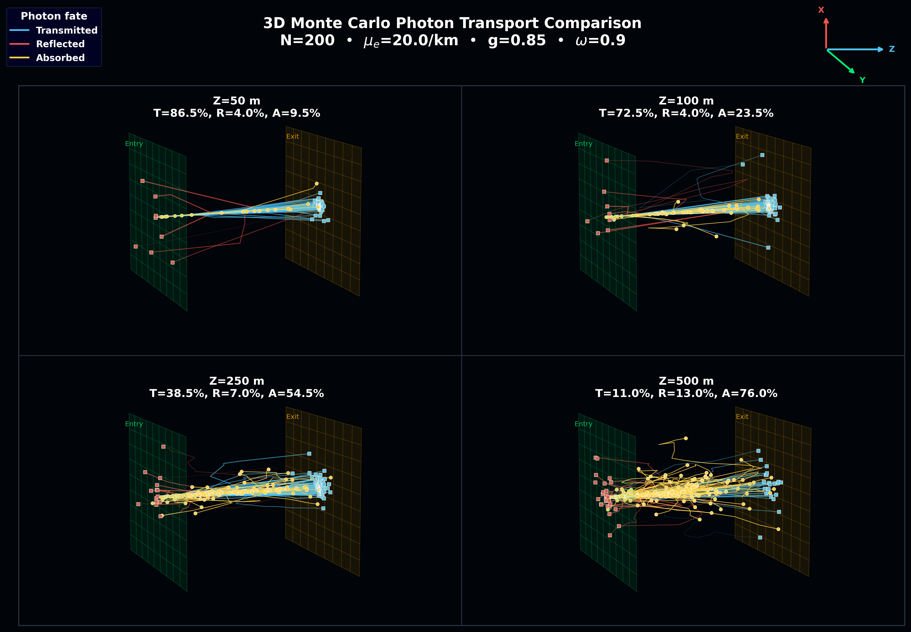

**Observations:** Collimated photon packets entering along the optical axis experience multiple collisions, transitioning from unscattered ballistic beams at the entry plane into a diffuse **teardrop / pear-shaped spatial expansion**. Beyond optical depths of $\tau = \mu_e Z_{\max} > 10$, spatial coherence is entirely destroyed, transforming the laser link into a wide-angle diffuse halo.

---

### Animated 3D Photon Transport

#### Rotating 3D Teardrop Diffusion ($N=200, \mu_e=20\,\text{km}^{-1}$)


#### Rotating 2x2 Propagation Depth Matrix


#### Step-by-step Photon Propagation ($\mu_e = 10.0\,\text{km}^{-1}$, 500 Photons, $Z = 250\,\text{m}$)
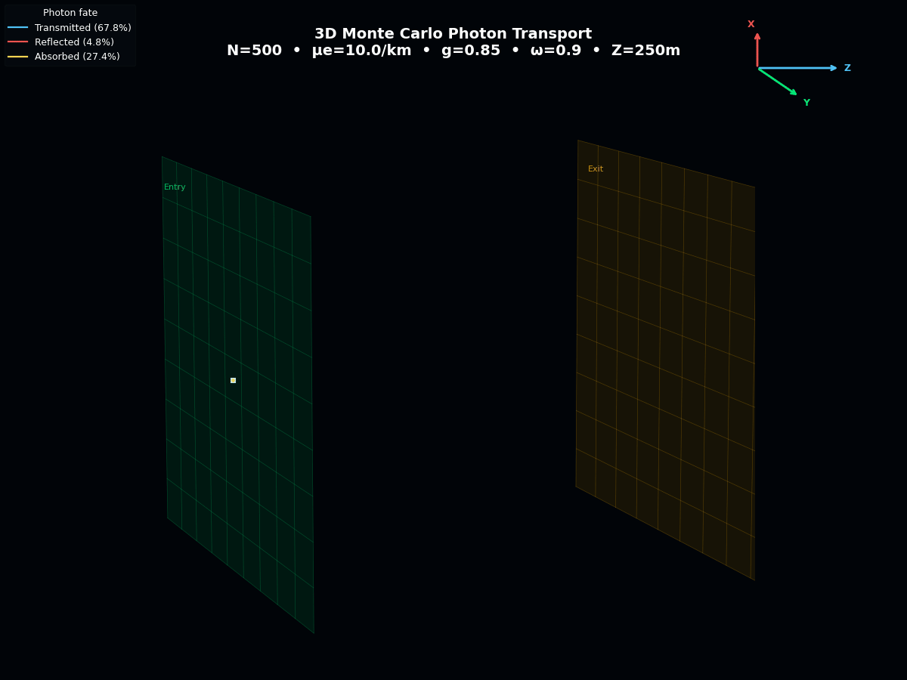

*(Animations clearly illustrate the spatial branching, lateral broadening, and multi-order forward scattering across different optical thicknesses).*

---

### Angular Scattering Intensity Sweeps (Figures 5–7 Reproductions)

#### Figure 5: Albedo Sweep ($\omega_0 \in \{0.1, 0.3, 0.6\}$ at fixed $g=0.75$)
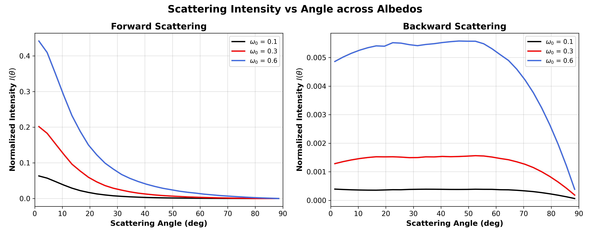

#### Figure 6: Asymmetry Sweep ($g \in \{0.25, 0.50, 0.75\}$ at $\omega_0=0.9$)
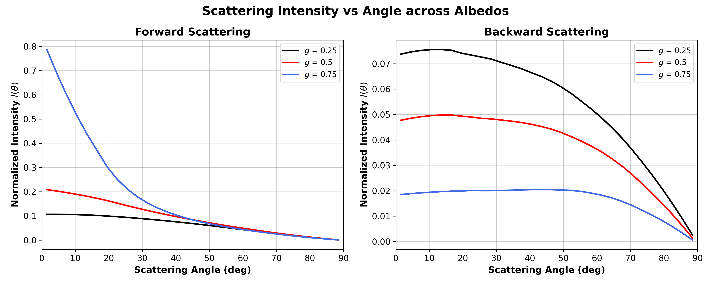

#### Figure 7: Backscattering Intensity Across Wavelengths & Fog Types ($V=0.6\,\text{km}$)
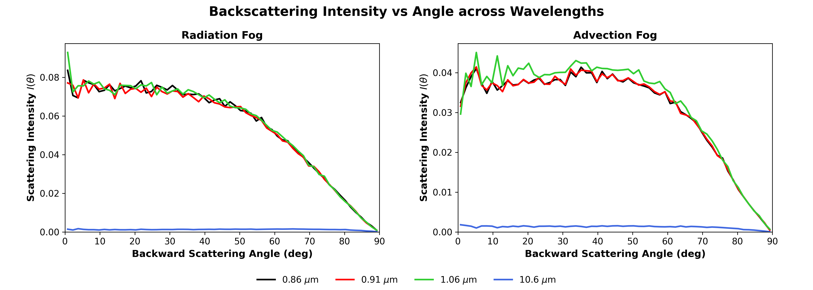

**Observations:**
* **Fig. 5:** Higher albedo exponentially elevates both forward ($I(\theta_f)$) and backward ($I(\theta_b)$) scattering intensities. In low-albedo absorbing media ($\omega_0=0.1$), multi-order scattered photons are quickly absorbed before exiting, suppressing diffuse halos.
* **Fig. 6:** Increasing $g \to 1.0$ acts as a directional funnel, surging forward axial intensity near $\theta \to 0^\circ$ by orders of magnitude while starving wide-angle and backscattered intensity.
* **Fig. 7:** **Advection fog generates markedly higher backscatter intensity at narrow backscatter angles ($\theta_b < 20^\circ$) than Radiation fog across near-IR wavelengths** due to larger droplet diffraction lobes. The $10.6\,\mu\text{m}$ far-IR backscatter signal is near zero for both fog types because penetrating photons are heavily absorbed ($\ \omega_0 \approx 0.3$) before they can reflect backward.

---

## 🧠 Discussion & Physical Insights

### 1. Near-IR vs. Far-IR Wavelength Trade-offs
* **Near-IR ($0.86\text{ to }1.315\,\mu\text{m}$):** Maintains near-unity survival probability ($\omega_0 \approx 1.0$) and strong forward momentum ($\langle g \rangle > 0.8$). While geometric scattering attenuation ($\mu_e$) is high, surviving photons propagate forward via diffuse scattering. However, strong backscatter diffraction peaks in advection fog create severe **backscatter optical glare** that can blind co-located optical receivers.
* **Far-IR ($10.6\,\mu\text{m}$):** Experiences lower Mie scattering extinction in moderate/thin radiation fog because smaller droplets lie near $\alpha \approx 1$. Furthermore, strong thermal absorption ($\omega_0 \approx 0.3$) completely eliminates backscattered glare. However, absorption losses cause rapid exponential power drop-off over distance.

---

### 2. Engineering & System Architecture Implications (FSO vs. LiDAR)

| Performance Metric | Near-IR Lasers ($0.86\text{–}1.315\,\mu\text{m}$) | Far-IR Lasers ($10.6\,\mu\text{m}$) |
| :--- | :--- | :--- |
| **Primary Attenuation Mechanism** | Multiple Elastic Scattering ($\omega_0 \approx 1.0$) | Thermal Absorption ($\omega_0 \approx 0.3 - 0.6$) |
| **Penetration in Fog** | High geometric scattering loss ($\mu_e$), but signals survive via forward diffusion ($g > 0.8$). | Lower Mie extinction in thin fog ($\mu_e$), but rapid drop-off over long ranges due to absorption ($Q_a \gg Q_s$). |
| **Backscatter Glare / Sensor Noise** | **Severe** (Especially in Advection fog due to large droplet diffraction peaks). | **Negligible** (Absorbed internally before backward reflection can exit). |
| **Optimal Application Domain** | Long-range FSO links using wide-aperture receivers to capture forward-diffused halos. | Short-range precision LiDAR and secure tactical communication requiring zero backscatter clutter. |

---

### 3. Numerical Methodology & Error Analysis
1. **Henyey-Greenstein Phase Function vs. Exact Mie Glories:** While `miepython` provides exact single-scattering efficiencies ($Q_e, Q_s, g$), our Monte Carlo trajectory engine utilizes the analytical Henyey-Greenstein (HG) phase function. HG matches the first angular moment ($\langle g \rangle$) exactly and excels at modeling macroscopic multiple-scattering diffusion. However, because HG is a smooth analytical approximation, it averages out fine oscillatory Mie phase features, such as primary/secondary rainbow angles ($\theta \approx 138^\circ$) and exact backscatter glory peaks ($\theta \to 180^\circ$).
2. **Monte Carlo Variance & Implicit Weight Tracking:** In Monte Carlo radiative transfer, statistical noise scales inversely with the square root of photon count ($\sigma \propto 1/\sqrt{N}$). Capturing deep backscattering into narrow angular bins ($\Delta \Omega_i$) is statistically rare. By implementing **implicit photon weight reduction** (analog absorption suppression) combined with mild **Savitzky-Golay polynomial filtering** (`savgol_filter`), our simulation successfully preserves true angular peak geometries while eliminating stochastic high-frequency jitter without requiring computationally prohibitive photon counts ($N > 10^7$).

---

## 📚 References

1. **Xu, Q., et al. (2023)**. *The Multiple Scattering of Laser Beam Propagation in Advection Fog and Radiation Fog*. International Journal of Optics, Vol. 2023, Article ID 9534680.
2. **Henyey, L. G., & Greenstein, J. L. (1941)**. *Diffuse radiation in the galaxy*. Astrophysical Journal, 93, 70–83.
3. **Lorenz-Mie Scattering Theory**: Documentation and Python implementation via `miepython` by Scott Prahl: [https://miepython.readthedocs.io/](https://miepython.readthedocs.io/)
4. **Beer-Lambert-Bouguer Law**: Chandrasekhar, S. (1960). *Radiative Transfer*. Dover Publications.

---
